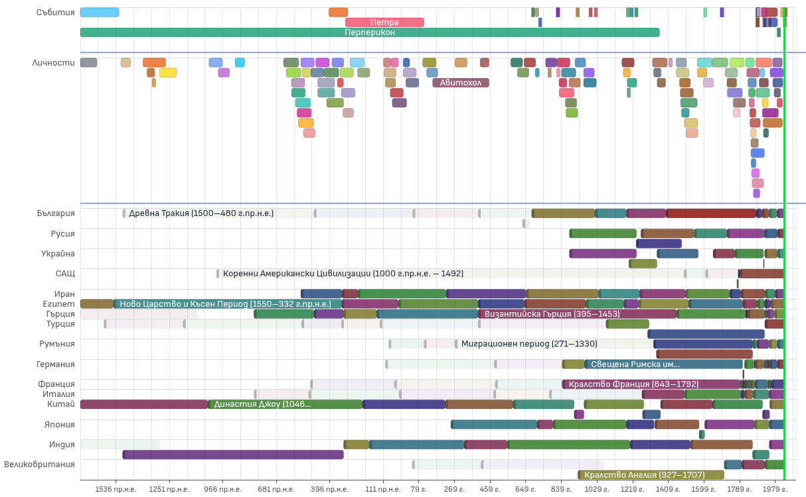

# България и светът

[Демо](https://prizemjavane.github.io/bulgaria-and-the-world/)

„България и светът“ е интерактивно уеб приложение, което визуализира хилядолетия от история — периоди, събития и личности от България, вплетени в контекста на световните цивилизации, империи и геополитически трансформации.



## Използвани технологии

Проектът е базиран на Angular, ECharts, Tailwind CSS, TypeScript.

## Инсталация

```bash
npm install
npm start
```

## Къде са данните

Всички данни се намират в директорията **[`public/data/`](public/data/)** като JSON файлове. Те се зареждат динамично по време на изпълнение на приложението.

### Файлова структура на данните

| Файл                    | Описание                                         |
|-------------------------|--------------------------------------------------|
| `manifest.json`         | Регистър на всички налични файлове с данни       |
| `defaults.json`         | Настройка кои елементи са видими по подразбиране |
| `dataset-*.json`        | Колекция от данни                                |
| `events.json`           | Събития                                          |
| `events-religions.json` | Допълнителни събития за датасет „Религии"        |
| `persons.json`          | Личности                                         |
| `dates.json`            | Дати                                             |
| `quotes.json`           | Цитати                                           |

За детайлна информация вижте [docs/data.md](docs/data.md) и [docs/knowledge-base.md](docs/knowledge-base.md).
